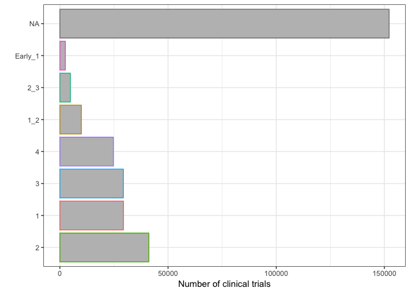

Identifying interesting questions/hypotheses about clinical trials
================

## Introduction

I’m not really sure what exactly to investigate right now, so I’m going
to try out a few things and see what’s worth
    pursuing.

    ## ── Attaching packages ────────────────────────────────────── tidyverse 1.2.1 ──

    ## ✔ ggplot2 3.0.0     ✔ purrr   0.2.5
    ## ✔ tibble  1.4.2     ✔ dplyr   0.7.6
    ## ✔ tidyr   0.8.1     ✔ stringr 1.3.1
    ## ✔ readr   1.1.1     ✔ forcats 0.3.0

    ## ── Conflicts ───────────────────────────────────────── tidyverse_conflicts() ──
    ## ✖ dplyr::filter() masks stats::filter()
    ## ✖ dplyr::lag()    masks stats::lag()

    ## 
    ## Attaching package: 'data.table'

    ## The following objects are masked from 'package:dplyr':
    ## 
    ##     between, first, last

    ## The following object is masked from 'package:purrr':
    ## 
    ##     transpose

    ## Loading required package: RPostgreSQL

    ## Loading required package: DBI

## Clinical trial characteristics

I’m going to look at the study characteristics of clinical trials using
the *studies* table since it has a lot of attributes that I think would
be useful. After looking at my [summary
notebook](https://github.com/jasonbaik94/clinical_trials/blob/master/aact_database_table_summary.md),
there’s data on the study type, the phase of a clinical trial, start and
end of duration of the trial, why it was stopped, and others.

First I load the *studies* table and get the relevant variables:

``` r
con <- aact_connector()
```

    ## Parsed with column specification:
    ## cols(
    ##   u = col_character(),
    ##   pw = col_character()
    ## )
    ## Parsed with column specification:
    ## cols(
    ##   u = col_character(),
    ##   pw = col_character()
    ## )

``` r
studies <- get_table(con,"studies") %>% select(nct_id,study_first_submitted_date,phase,
                                               completion_date,study_type,
                                               baseline_population,overall_status,
                                               why_stopped,is_fda_regulated_drug) %>% 
  collect() %>% distinct()

dbDisconnect(con)
```

    ## [1] TRUE

``` r
studies
```

    ## # A tibble: 294,117 x 9
    ##    nct_id study_first_sub… phase completion_date study_type
    ##    <chr>  <date>           <chr> <date>          <chr>     
    ##  1 NCT00… 2007-04-03       Phas… 2008-02-29      Intervent…
    ##  2 NCT00… 2007-04-02       <NA>  2013-02-28      Observati…
    ##  3 NCT00… 2007-04-03       N/A   2010-08-31      Intervent…
    ##  4 NCT00… 2007-03-14       Phas… 2007-09-30      Intervent…
    ##  5 NCT00… 2007-04-03       Phas… 2009-12-31      Intervent…
    ##  6 NCT00… 2007-04-02       Phas… 2015-08-22      Intervent…
    ##  7 NCT00… 2007-04-02       Phas… 2008-09-30      Intervent…
    ##  8 NCT00… 2007-04-02       Phas… 2007-04-30      Intervent…
    ##  9 NCT00… 2007-04-02       Phas… 2007-09-02      Intervent…
    ## 10 NCT00… 2007-04-03       N/A   2006-11-30      Intervent…
    ## # ... with 294,107 more rows, and 4 more variables:
    ## #   baseline_population <chr>, overall_status <chr>, why_stopped <chr>,
    ## #   is_fda_regulated_drug <lgl>

## Phases of clinical trials

I’m interested in the types of phases given for clinical trials

``` r
studies %>% 
  ggplot() +
  geom_bar(aes(forcats::fct_infreq(phase),color=phase),fill="gray") +
  coord_flip() +
  ylab("Number of clinical trials") +
  xlab("") +
  theme(
    legend.position = "none"
  )
```

<!-- -->

Three things:

1)  Over 15K trials don’t have a phase attributed, as either NA or N/A

2)  There’s a preceding “Phase” before the actual number

3)  There’s some trials that are combinations of phases. What does that
    mean?

## Clinical trial phase clean up

1)  Separate phase wording from numbers

2)  make separate ‘early’ column for early phase 1 distinction from
    phase 1

3)  make combo phase trials as phase 1 + ’\_’ + phase 2. This will make
    the whole column a character which I’m ok with-don’t want to treat
    these as continuous or integer but as distinct entities

4)  Combine trials without a phase as one NA value not NA or N/A

5)  save as a data file (make a data/ directory)

<!-- end list -->

``` r
phases <- studies$phase

table(phases) 
```

    ## phases
    ##   Early Phase 1             N/A         Phase 1 Phase 1/Phase 2 
    ##            2526           91314           29395            9934 
    ##         Phase 2 Phase 2/Phase 3         Phase 3         Phase 4 
    ##           41112            4886           29351           24742

``` r
phase_splt <- strsplit(phases," ") 

nsplits <- sapply(phase_splt,length)

table(nsplits)
```

    ## nsplits
    ##      1      2      3 
    ## 152171 124600  17346

now I split phases by a space, and so either I get no splits for NA and
N/A, 1 split for Phase \[1234\], or two splits for Early Phase 1 and
Phase \[12\]/Phase \[23\].

For the no splits, I need to use one common identifier, NA

``` r
phases[nsplits==1] <- NA
```

For 1 split, I need to use just the integer.

``` r
table(phases[nsplits==2])
```

    ## 
    ## Phase 1 Phase 2 Phase 3 Phase 4 
    ##   29395   41112   29351   24742

``` r
n2_phase_splt <- strsplit(phases[nsplits==2]," ")

phases[nsplits==2] <- sapply(n2_phase_splt,function(x){x[2]})
```

For 2 splits, I need to be more crafty. Let’s first deal with early
phase 1.

``` r
earlies <- grepl("Early",phases)

table(phases[earlies]) #just checking
```

    ## 
    ## Early Phase 1 
    ##          2526

``` r
phases[earlies] <- "Early_1"
```

Now combo trials.

``` r
combos <- !earlies & nsplits==3

table(phases[combos]) #just checking
```

    ## 
    ## Phase 1/Phase 2 Phase 2/Phase 3 
    ##            9934            4886

``` r
tmp <- strsplit(phases[combos]," ")

second <- sapply(tmp,function(x){x[3]})

tmp <- sapply(tmp,function(x){x[2]})

first <- sapply(strsplit(tmp,"/"),function(x){x[1]})

phases[combos] <- paste(first,second,sep="_")
```

Ok let’s see the cleaned version

``` r
table(phases)
```

    ## phases
    ##       1     1_2       2     2_3       3       4 Early_1 
    ##   29395    9934   41112    4886   29351   24742    2526

``` r
studies <- studies %>% mutate(clean_phase = phases)

studies %>% 
  ggplot() +
  geom_bar(aes(forcats::fct_infreq(clean_phase),color=clean_phase),fill="gray") +
  coord_flip() +
  ylab("Number of clinical trials") +
  xlab("") +
  theme(
    legend.position = "none"
  )
```

<!-- -->

That’s better.

## Cleaning eligibility ages

Thev ages given to the eligibility are all coded differently, but I want
them all in the same units

``` r
con <- aact_connector()
```

    ## Parsed with column specification:
    ## cols(
    ##   u = col_character(),
    ##   pw = col_character()
    ## )
    ## Parsed with column specification:
    ## cols(
    ##   u = col_character(),
    ##   pw = col_character()
    ## )

``` r
eligibilities <- get_table(con,"eligibilities") %>% select(nct_id,nct_id,minimum_age,maximum_age) %>% 
  collect() %>% distinct()

dbDisconnect(con)
```

    ## [1] TRUE

``` r
transform_trial_age_range <- function(df,...){
  
  df %>% 
    mutate(
      minimum_age_num = sapply(strsplit(minimum_age," "),function(x){x[1]}),
      minimum_age_unit = sapply(strsplit(minimum_age," "),function(x){x[2]}),
      maximum_age_num = sapply(strsplit(maximum_age," "),function(x){x[1]}),
      maximum_age_unit = sapply(strsplit(maximum_age," "),function(x){x[2]})
    )
  
}

eligibilities_sep <- transform_trial_age_range(eligibilities)

eligibilities_sep$minimum_age_num[eligibilities_sep$minimum_age_num=="N/A"] <- NA
eligibilities_sep$minimum_age_unit[eligibilities_sep$minimum_age_unit=="N/A"] <- NA
eligibilities_sep$maximum_age_num[eligibilities_sep$maximum_age_num=="N/A"] <- NA
eligibilities_sep$maximum_age_unit[eligibilities_sep$maximum_age_unit=="N/A"] <- NA

eligibilities_sep <- eligibilities_sep %>% select(-maximum_age,-minimum_age)

table(eligibilities_sep$minimum_age_unit)
```

    ## 
    ##   Days  Month Months  Weeks   Year  Years 
    ##    193    737   4043    831   1926 261486

``` r
eligibilities_sep <- eligibilities_sep %>% 
  rename(
    maximum_age = maximum_age_num,
    minimum_age = minimum_age_num
  )

make_master_eligibility_ages <- function(ct){
  
  round_n <- 0
  
  ct$minimum_age <- as.integer(ct$minimum_age)
  ct$maximum_age <- as.integer(ct$maximum_age)
  
  ct %>% 
  
  mutate(
    
    min_minute_years = ifelse(replace_na(stringr::str_detect(ct$minimum_age_unit,"Minute|Minutes"),F),round(minimum_age/60/24/7/52,round_n),minimum_age),
    min_hour_years = ifelse(replace_na(stringr::str_detect(ct$minimum_age_unit,"Hour|Hours"),F),round(minimum_age/24/7/52,round_n),minimum_age),
    min_day_years = ifelse(replace_na(stringr::str_detect(ct$minimum_age_unit,"Day|Days"),F),round(minimum_age/365,round_n),minimum_age),
    min_week_years = ifelse(replace_na(stringr::str_detect(ct$minimum_age_unit,"Week|Weeks"),F),round(minimum_age/52,round_n),minimum_age),
    min_month_years = ifelse(replace_na(stringr::str_detect(ct$minimum_age_unit,"Month|Months"),F),round(minimum_age/12,round_n),minimum_age),
    min_year_years = ifelse(replace_na(stringr::str_detect(ct$minimum_age_unit,"Year|Years"),F),minimum_age,minimum_age),
    
    min_minutes=as.integer(replace_na(stringr::str_detect(ct$minimum_age_unit,"Minute|Minutes"),F)),
    min_hours=as.integer(replace_na(stringr::str_detect(ct$minimum_age_unit,"Hour|Hours"),F)),
    min_days=as.integer(replace_na(stringr::str_detect(ct$minimum_age_unit,"Day|Days"),F)),
    min_weeks=as.integer(replace_na(stringr::str_detect(ct$minimum_age_unit,"Week|Weeks"),F)),
    min_months=as.integer(replace_na(stringr::str_detect(ct$minimum_age_unit,"Month|Months"),F)),
    min_years=as.integer(replace_na(stringr::str_detect(ct$minimum_age_unit,"Year|Years"),F)),
    
    max_minute_years = ifelse(replace_na(stringr::str_detect(ct$maximum_age_unit,"Minute|Minutes"),F),round(maximum_age/60/24/7/52,round_n),maximum_age),
    max_hour_years = ifelse(replace_na(stringr::str_detect(ct$maximum_age_unit,"Hour|Hours"),F),round(maximum_age/24/7/52,round_n),maximum_age),
    max_day_years = ifelse(replace_na(stringr::str_detect(ct$maximum_age_unit,"Day|Days"),F),round(maximum_age/365,round_n),maximum_age),
    max_week_years = ifelse(replace_na(stringr::str_detect(ct$maximum_age_unit,"Week|Weeks"),F),round(maximum_age/52,round_n),maximum_age),
    max_month_years = ifelse(replace_na(stringr::str_detect(ct$maximum_age_unit,"Month|Months"),F),round(maximum_age/12,round_n),maximum_age),
    max_year_years = ifelse(replace_na(stringr::str_detect(ct$maximum_age_unit,"Year|Years"),F),maximum_age,maximum_age),
    
    max_minutes=as.integer(replace_na(stringr::str_detect(ct$maximum_age_unit,"Minute|Minutes"),F)),
    max_hours=as.integer(replace_na(stringr::str_detect(ct$maximum_age_unit,"Hour|Hours"),F)),
    max_days=as.integer(replace_na(stringr::str_detect(ct$maximum_age_unit,"Day|Days"),F)),
    max_weeks=as.integer(replace_na(stringr::str_detect(ct$maximum_age_unit,"Week|Weeks"),F)),
    max_months=as.integer(replace_na(stringr::str_detect(ct$maximum_age_unit,"Month|Months"),F)),
    max_years=as.integer(replace_na(stringr::str_detect(ct$maximum_age_unit,"Year|Years"),F)),
    
    minimum_master_age = min_minute_years * min_minutes + min_hour_years * min_hours + min_day_years * min_days + min_week_years * min_weeks + min_month_years * min_months + min_year_years * min_years,
    maximum_master_age = max_minute_years * max_minutes + max_hour_years * max_hours + max_day_years * max_days + max_week_years * max_weeks + max_month_years * max_months + max_year_years * max_years
    
  )  %>% 
  data.table

}

eligibilities_sep_master_dt <- make_master_eligibility_ages(eligibilities_sep) %>% select(nct_id,minimum_master_age,maximum_master_age)
```

## Joining eligibility age and phases

I’m interested to see who predominantly enters certain trial phases.

``` r
setkey(eligibilities_sep_master_dt,nct_id)

studies_dt <- data.table(studies)

setkey(studies_dt,nct_id)

study_eligibility_dt <- studies_dt[eligibilities_sep_master_dt][,.(nct_id,clean_phase,minimum_master_age,maximum_master_age)]

head(study_eligibility_dt)
```

    ##         nct_id clean_phase minimum_master_age maximum_master_age
    ## 1: NCT00000102         1_2                 14                 35
    ## 2: NCT00000104        <NA>                 NA                 NA
    ## 3: NCT00000105        <NA>                 18                 NA
    ## 4: NCT00000106        <NA>                 18                 65
    ## 5: NCT00000107        <NA>                 17                 60
    ## 6: NCT00000108        <NA>                 50                 65

## Designate pediatric clinical trials and trials inclusive of pediatric patients

``` r
study_eligibility_dt[,
                     `:=`(pediatric_trial = maximum_master_age < 18,
                          pediatric_inclusive = minimum_master_age < 18)
                     ]
```

## Output

output this for use later

``` r
study_eligibility_dt %>% write_csv("study_phase_age_eligibility.csv")
```
