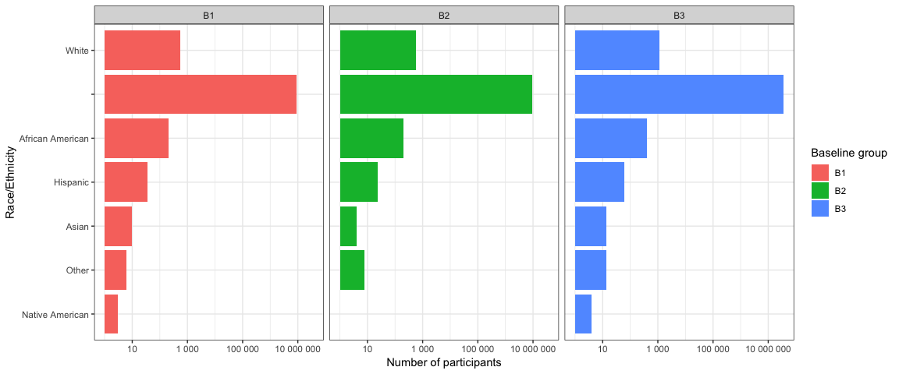

Clinical trial measurements
================

# Introduction

This notebook will explore measurements recorded for clinical trials.
The utility of these measurements will be evaluated

``` r
library(tidyverse)

source("helper_functions.R")
```

# Clinical trial measurements

These are one of the four results measurements for clinical trials
[Ref](https://aact.ctti-clinicaltrials.org/schema). And each trial has
different result groups.

``` r
con <- aact_connector()
```

    Parsed with column specification:
    cols(
      u = col_character(),
      pw = col_character()
    )
    Parsed with column specification:
    cols(
      u = col_character(),
      pw = col_character()
    )

The Result\_Groups table represents an aggregate list of all groups
associated with these result types. All result tables (Outcomes,
Outcome\_Counts, Baseline\_Measures, Reported\_Events, etc.) relate to
Result\_Groups via the foreign key result\_group\_id

``` r
result_groups <- get_table(con,"result_groups") %>% collect()
```

How many result types are there for trials?

``` r
tmp <- result_groups %>% 
  select(nct_id,result_type) %>% 
  distinct() %>% 
  group_by(nct_id) %>% 
  count()

tmp
```

    # A tibble: 34,431 x 2
    # Groups:   nct_id [34,431]
       nct_id          n
       <chr>       <int>
     1 NCT00000125     4
     2 NCT00000134     4
     3 NCT00000135     4
     4 NCT00000136     4
     5 NCT00000142     4
     6 NCT00000143     4
     7 NCT00000371     4
     8 NCT00000378     4
     9 NCT00000392     4
    10 NCT00000479     4
    # ... with 34,421 more rows

``` r
table(tmp$n)
```

``` 

    3     4 
  206 34225 
```

Every trial here has atleast 2 result\_types, where majority have all 4
and only a few hundred has only three.

How many trials are represented here? Only 34,431

How many groups are in the result\_type’s?

``` r
tmp <- result_groups %>% 
  group_by(nct_id,result_type) %>% 
  count()

tmp
```

    # A tibble: 137,518 x 3
    # Groups:   nct_id, result_type [137,518]
       nct_id      result_type          n
       <chr>       <chr>            <int>
     1 NCT00000125 Baseline             3
     2 NCT00000125 Outcome              2
     3 NCT00000125 Participant Flow     2
     4 NCT00000125 Reported Event       2
     5 NCT00000134 Baseline             4
     6 NCT00000134 Outcome              3
     7 NCT00000134 Participant Flow     3
     8 NCT00000134 Reported Event       3
     9 NCT00000135 Baseline             3
    10 NCT00000135 Outcome              2
    # ... with 137,508 more rows

``` r
table(tmp$n)
```

``` 

    1     2     3     4     5     6     7     8     9    10    11    12 
33050 34916 25667 12563  4622  4969  1495  2671  1114  1726   452  1975 
   13    14    15    16    17    18    19    20    21    22    23    24 
  297  1006   519   945   196   866   152   712   297   394   110   678 
   25    26    27    28    29    30    31    32    33    34    35    36 
  115   319   188   374    64   373    63   290   127   164    86   291 
   37    38    39    40    41    42    43    44    45    46    47    48 
   52   125    97   177    41   156    31   144    94    77    38   161 
   49    50    51    52    53    54    55    56    57    58    59    60 
   40    81    58    87    31   105    22    96    36    60    21    85 
   61    62    63    64    65    66    67    68    69    70    71    72 
   20    41    38    68    28    67    18    38    36    39     9    56 
   73    74    75    76    77    78    79    80    81    82    83    84 
   12    32    26    31    13    36    11    43    16    21    13    41 
   85    86    87    88    89    90    91    92    93    94    95    96 
   14    20    15    24     4    34    11    23    23    14    16    27 
   97    98    99   100   101   102   103   104   105   106   107   108 
    6    14    10    20     6    22     6    11    12     8     5    21 
  109   110   111   112   113   114   115   116   117   118   119   120 
    4    13     7    14     8    13     8    10    12     6     5    14 
  121   122   123   124   125   126   127   128   129   130   131   132 
    3     7     7    11     3    12     1     9     9     7     2    18 
  133   134   135   136   137   138   139   140   141   142   143   144 
    1     5     9    12     2    13     5     7     4     3     4     9 
  145   146   147   148   149   150   151   152   153   154   155   156 
    3     7     6     3     5     7     4     2     8     2     4    18 
  157   158   159   160   161   162   163   164   165   166   167   168 
    2     3     2     8     3     4     3     5     6     1     3     8 
  169   170   171   172   173   174   175   176   177   178   180   182 
    1     6     4     5     1     9     3     5     4     1     5     5 
  184   185   186   187   188   189   190   192   193   194   195   196 
    7     1     5     2     5     2     1     4     2     1     1     2 
  197   198   200   201   202   204   206   207   208   209   210   212 
    2     3     5     2     4     2     1     1     1     1     3     2 
  213   216   217   218   219   220   221   222   223   224   225   226 
    1     5     2     1     2     5     1     2     2     2     1     1 
  228   230   234   235   236   238   240   241   243   244   246   248 
    5     2     1     1     3     1    10     1     2     1     2     2 
  249   254   255   260   262   263   264   265   266   268   270   271 
    1     1     2     2     1     1     1     1     1     1     2     2 
  272   273   274   276   278   280   282   283   285   288   295   296 
    1     1     1     1     1     1     2     1     1     2     1     1 
  297   299   308   309   310   313   314   315   317   320   326   329 
    1     1     3     1     1     1     1     1     1     1     1     1 
  330   333   346   350   355   359   360   372   375   376   387   405 
    1     2     1     2     1     1     1     1     1     1     1     2 
  407   408   411   417   419   420   428   460   485   496   500   512 
    1     1     1     1     1     2     1     1     1     1     1     1 
  528   552   553   569   680   885  1503 
    1     1     1     1     1     1     1 
```

The `n` indicates there’s n groups for each result\_type. There could be
a lot\!

Ok cool\! Let’s try to get
deeper.

## Baseline Measurements

``` r
baseline_measurements <- get_table(con,"baseline_measurements") %>% collect()
```

For a random nct like *NCT00000125*, let’s get the baseline
measurements.

``` r
nct="NCT00000125"

baseline_measurements %>% 
  filter(nct_id==nct)
```

    # A tibble: 27 x 18
           id nct_id result_group_id ctgov_group_code classification category
        <int> <chr>            <int> <chr>            <chr>          <chr>   
     1 4.47e6 NCT00…         4287946 B3               Other          ""      
     2 4.47e6 NCT00…         4287947 B2               Other          ""      
     3 4.47e6 NCT00…         4287948 B1               Other          ""      
     4 4.47e6 NCT00…         4287946 B3               White          ""      
     5 4.47e6 NCT00…         4287947 B2               White          ""      
     6 4.47e6 NCT00…         4287948 B1               White          ""      
     7 4.47e6 NCT00…         4287946 B3               Hispanic       ""      
     8 4.47e6 NCT00…         4287947 B2               Hispanic       ""      
     9 4.47e6 NCT00…         4287948 B1               Hispanic       ""      
    10 4.47e6 NCT00…         4287946 B3               African Ameri… ""      
    # ... with 17 more rows, and 12 more variables: title <chr>,
    #   description <chr>, units <chr>, param_type <chr>, param_value <chr>,
    #   param_value_num <dbl>, dispersion_type <chr>, dispersion_value <chr>,
    #   dispersion_value_num <dbl>, dispersion_lower_limit <dbl>,
    #   dispersion_upper_limit <dbl>, explanation_of_na <chr>

With this we can see the number of participants.

``` r
baseline_measurements %>% 
  filter(nct_id==nct) %>% 
  select(ctgov_group_code,classification,title,units,param_value_num) %>% 
  ggplot() +
  geom_bar(aes(forcats::fct_reorder(classification,param_value_num),param_value_num,fill=ctgov_group_code),stat="identity") +
  facet_wrap(.~ctgov_group_code) +
  scale_y_continuous(trans = "log10",labels = scales::number) +
  coord_flip() +
  xlab("Race/Ethnicity") +
  ylab("Number of participants") +
  theme_bw() +
  guides(fill=guide_legend(title = "Baseline group"))
```

<!-- -->

Interesting - so, at least for the baseline measurements, this tells me
how many people were in each group.

This is probably what all the other measurements
describe.

<!-- ## Outcome Measurements -->

<!-- ```{r} -->

<!-- outcome_measurements <- get_table(con,"outcome_measurements") %>% collect() -->

<!-- ``` -->

<!-- ```{r} -->

<!-- ``` -->

<!-- ## Reported events -->

<!-- ```{r} -->

<!-- reported_events <- get_table(con,"reported_events") %>% collect() -->

<!-- ``` -->

<!-- ```{r} -->

<!-- ``` -->

<!-- ## Participant flows -->

<!-- ```{r} -->

<!-- participant_flows <- get_table(con,"participant_flows") %>% collect() -->

<!-- ``` -->

<!-- ```{r} -->

<!-- ``` -->
