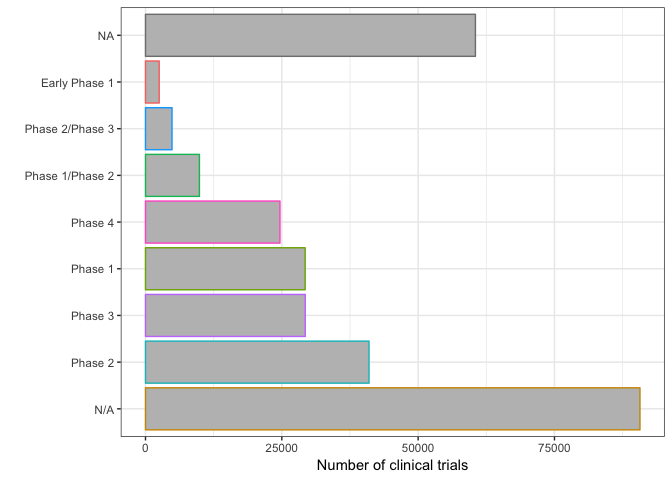

Identifying interesting questions/hypotheses about clinical trials
================

## Introduction

I’m not really sure what exactly to investigate right now, so I’m going
to try out a few things and see what’s worth
    pursuing.

    ## ── Attaching packages ─────────────────────────────────────────────── tidyverse 1.2.1 ──

    ## ✔ ggplot2 3.0.0     ✔ purrr   0.2.5
    ## ✔ tibble  1.4.2     ✔ dplyr   0.7.6
    ## ✔ tidyr   0.8.1     ✔ stringr 1.3.1
    ## ✔ readr   1.1.1     ✔ forcats 0.3.0

    ## ── Conflicts ────────────────────────────────────────────────── tidyverse_conflicts() ──
    ## ✖ dplyr::filter() masks stats::filter()
    ## ✖ dplyr::lag()    masks stats::lag()

    ## Loading required package: RPostgreSQL

    ## Loading required package: DBI

## Clinical trial characteristics

I’m going to look at the studfy characteristics of clinical trials using
the *studies* table since it has a lot of attributes that I think would
be useful. After looking at my [summary
notebook](https://github.com/jasonbaik94/clinical_trials/blob/master/aact_database_table_summary.md),
there’s data on the study type, the phase of a clinical trial, start and
end of duration of the trial, why it was stopped, and others.

First I load the *studies* table and get the relevant variables:

``` r
con <- aact_connector()
```

    ## Parsed with column specification:
    ## cols(
    ##   u = col_character(),
    ##   pw = col_character()
    ## )
    ## Parsed with column specification:
    ## cols(
    ##   u = col_character(),
    ##   pw = col_character()
    ## )

``` r
studies <- get_table(con,"studies") %>% select(nct_id,study_first_submitted_date,phase,
                                               completion_date,study_type,
                                               baseline_population,overall_status,
                                               why_stopped,is_fda_regulated_drug) %>% 
  collect() %>% distinct()

studies
```

    ## # A tibble: 291,361 x 9
    ##    nct_id study_first_sub… phase completion_date study_type
    ##    <chr>  <date>           <chr> <date>          <chr>     
    ##  1 NCT02… 2014-02-05       <NA>  2015-07-31      Observati…
    ##  2 NCT02… 2014-12-04       N/A   2015-12-31      Intervent…
    ##  3 NCT02… 2014-12-05       Phas… 2016-05-31      Intervent…
    ##  4 NCT02… 2014-12-05       Phas… 2017-12-21      Intervent…
    ##  5 NCT02… 2014-12-04       Phas… 2020-07-31      Intervent…
    ##  6 NCT02… 2014-12-05       Phas… 2016-06-30      Intervent…
    ##  7 NCT02… 2014-12-05       Phas… 2024-12-02      Intervent…
    ##  8 NCT02… 2014-12-06       N/A   2016-12-31      Intervent…
    ##  9 NCT02… 2014-12-05       Phas… 2018-05-31      Intervent…
    ## 10 NCT02… 2014-12-06       <NA>  2019-06-30      Observati…
    ## # ... with 291,351 more rows, and 4 more variables:
    ## #   baseline_population <chr>, overall_status <chr>, why_stopped <chr>,
    ## #   is_fda_regulated_drug <lgl>

## Phases of clinical trials

I’m interested in the types of phases given for clinical trials

``` r
studies %>% 
  ggplot() +
  geom_bar(aes(forcats::fct_infreq(phase),color=phase),fill="gray") +
  coord_flip() +
  ylab("Number of clinical trials") +
  xlab("") +
  theme(
    legend.position = "none"
  )
```

<!-- -->

Three things:

1)  Over 15K trials don’t have a phase attributed, as either NA or N/A

2)  There’s a preceding “Phase” before the actual number

3)  There’s some trials that are combinations of phases. What does that
    mean?

## Clinical trial phase clean up

1)  Separate phase wording from numbers

2)  make separate ‘early’ column for early phase 1 distinction from
    phase 1

3)  make combo phase trials as phase 1 + ’\_’ + phase 2. This will make
    the whole column a character which I’m ok with-don’t want to treat
    these as continuous or integer but as distinct entities

4)  Combine trials without a phase as one NA value not NA or N/A

5)  save as a data file (make a data/ directory)
