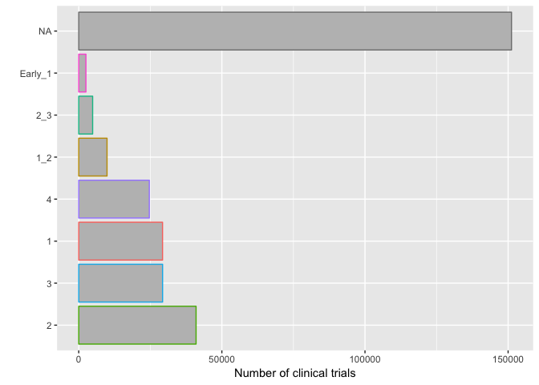
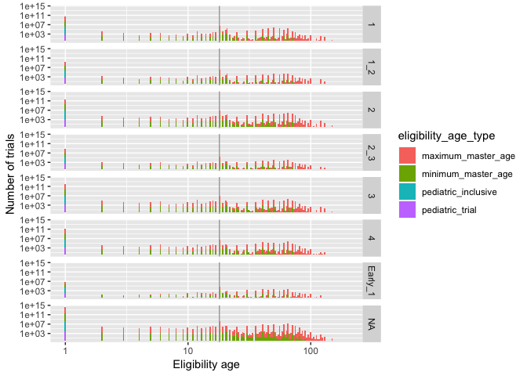
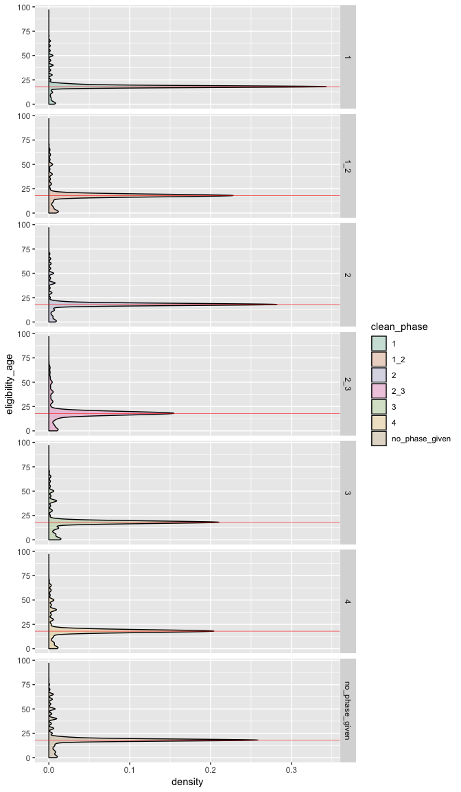
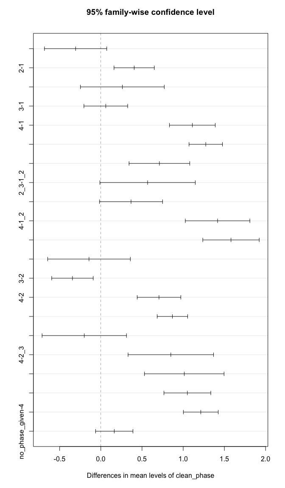
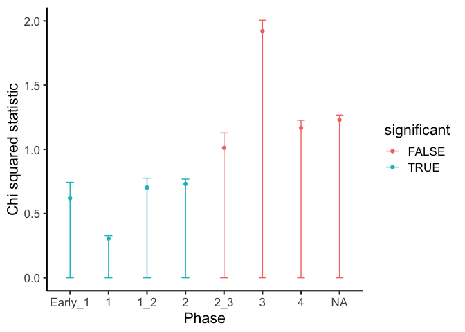
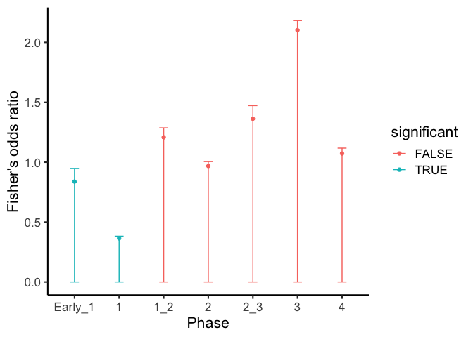

Clinical trials, phases, and their types
================

## Introduction

This notebook outlines the exploration of the processed data from this
[notebook](id-ing_Qs_hypotheses_about_CTs.md)

``` r
library(tidyverse)
```

    ## ── Attaching packages ────────────────────────────────────── tidyverse 1.2.1 ──

    ## ✔ ggplot2 3.0.0     ✔ purrr   0.2.5
    ## ✔ tibble  1.4.2     ✔ dplyr   0.7.6
    ## ✔ tidyr   0.8.1     ✔ stringr 1.3.1
    ## ✔ readr   1.1.1     ✔ forcats 0.3.0

    ## ── Conflicts ───────────────────────────────────────── tidyverse_conflicts() ──
    ## ✖ dplyr::filter() masks stats::filter()
    ## ✖ dplyr::lag()    masks stats::lag()

## Load data

``` r
data <- read_csv("study_phase_age_eligibility.csv")
```

    ## Parsed with column specification:
    ## cols(
    ##   nct_id = col_character(),
    ##   clean_phase = col_character(),
    ##   minimum_master_age = col_integer(),
    ##   maximum_master_age = col_integer(),
    ##   pediatric_trial = col_logical(),
    ##   pediatric_inclusive = col_logical()
    ## )

## Frequency of trials in different phases

I previously looked at this but I want to put the data here too

``` r
data %>% 
  ggplot() +
  geom_bar(aes(forcats::fct_infreq(clean_phase),color=clean_phase),fill="gray") +
  coord_flip() +
  ylab("Number of clinical trials") +
  xlab("") +
  theme(
    legend.position = "none"
  )
```

<!-- -->

## Are trials given for many phases or just one?

``` r
tmp <- data %>% 
  distinct(nct_id,clean_phase) %>% 
  count(nct_id) %>% 
  arrange(desc(n))

tmp
```

    ## # A tibble: 292,680 x 2
    ##    nct_id          n
    ##    <chr>       <int>
    ##  1 NCT00000102     1
    ##  2 NCT00000104     1
    ##  3 NCT00000105     1
    ##  4 NCT00000106     1
    ##  5 NCT00000107     1
    ##  6 NCT00000108     1
    ##  7 NCT00000110     1
    ##  8 NCT00000111     1
    ##  9 NCT00000112     1
    ## 10 NCT00000113     1
    ## # ... with 292,670 more rows

Nope. Trials are only in one phase or phase combo or not given.

## What is the eligibility age distribution for trials?

``` r
data %>% 
  filter(is.na(clean_phase))
```

    ## # A tibble: 151,184 x 6
    ##    nct_id clean_phase minimum_master_… maximum_master_… pediatric_trial
    ##    <chr>  <chr>                  <int>            <int> <lgl>          
    ##  1 NCT00… <NA>                      NA               NA NA             
    ##  2 NCT00… <NA>                      18               NA NA             
    ##  3 NCT00… <NA>                      18               65 FALSE          
    ##  4 NCT00… <NA>                      17               60 FALSE          
    ##  5 NCT00… <NA>                      50               65 FALSE          
    ##  6 NCT00… <NA>                      18               49 FALSE          
    ##  7 NCT00… <NA>                       8               18 FALSE          
    ##  8 NCT00… <NA>                      50               NA NA             
    ##  9 NCT00… <NA>                      NA                1 TRUE           
    ## 10 NCT00… <NA>                      18               46 FALSE          
    ## # ... with 151,174 more rows, and 1 more variable:
    ## #   pediatric_inclusive <lgl>

``` r
data_eligibility_age_gathered <- data %>% 
  gather(eligibility_age_type,eligibility_age,-nct_id,-clean_phase) 

data_eligibility_age_gathered%>% 
  ggplot() +
  geom_vline(xintercept=18,color="darkgray",size=.5) +
  geom_histogram(aes(eligibility_age,fill=eligibility_age_type),bins=200) +
  scale_x_log10() +
  scale_y_log10() +
  facet_grid(clean_phase~.) +
  ylab("Number of trials") +
  xlab("Eligibility age")
```

    ## Warning: Transformation introduced infinite values in continuous x-axis

    ## Warning: Removed 704009 rows containing non-finite values (stat_bin).

    ## Warning: Transformation introduced infinite values in continuous y-axis

    ## Warning: Removed 5321 rows containing missing values (geom_bar).

<!-- -->

This may not be the easiest graph to look at, but it gives some good
insight.

1)  The eligibility is roughly the same for trials without a phase and
    with a phase.

2)  The spike (dark gray line) for the minimum age is expected - it’s
    the legal age for consent to trials will allow them to enroll more
    easily.

I think there’ subtle changes in bar height across the phases, so I
think I’ll want to look more closely at this.

## Is the minumum age significantly lower across phases?

I’m not interested in the maximum age, just whether younger patients are
eligible for trials for which they have historically not been.

``` r
df <- data_eligibility_age_gathered %>% 
  filter(eligibility_age_type=="minimum_master_age") %>% 
  select(-eligibility_age_type,nct_id) 

df[is.na(df$clean_phase),"clean_phase"] <- "no_phase_given"

df %>% 
  ggplot() +
  geom_density(aes(
    eligibility_age,
    group=factor(clean_phase),
    fill=clean_phase),
    na.rm = F,alpha=.2) +
  geom_vline(xintercept=18,
             color="red",
             size=.2) +
  scale_fill_brewer(palette="Dark2") +
  facet_grid(clean_phase~.) +
  coord_flip()
```

    ## Warning: Removed 24816 rows containing non-finite values (stat_density).

<!-- -->

``` r
g <- glm(eligibility_age ~ clean_phase - 1,
      data=df,
      family="quasipoisson")

g$coefficients[order(g$coefficients)]
```

    ##            clean_phase1_2              clean_phase1 
    ##                  2.933763                  2.945786 
    ##              clean_phase3            clean_phase2_3 
    ##                  2.952893                  2.963528 
    ##              clean_phase2        clean_phaseEarly_1 
    ##                  2.970834                  2.999241 
    ##              clean_phase4 clean_phaseno_phase_given 
    ##                  3.006272                  3.014403

``` r
a <- aov(g)

summary(a)
```

    ##                 Df    Sum Sq  Mean Sq F value Pr(>F)    
    ## clean_phase      8 106088189 13261024  112569 <2e-16 ***
    ## Residuals   267856  31554352      118                   
    ## ---
    ## Signif. codes:  0 '***' 0.001 '**' 0.01 '*' 0.05 '.' 0.1 ' ' 1
    ## 24816 observations deleted due to missingness

``` r
TukeyHSD(a)
```

    ##   Tukey multiple comparisons of means
    ##     95% family-wise confidence level
    ## 
    ## Fit: aov(formula = g)
    ## 
    ## $clean_phase
    ##                              diff         lwr         upr     p adj
    ## 1_2-1                  -0.2273770 -0.61948516  0.16473120 0.6490107
    ## 2-1                     0.4825814  0.22552722  0.73963552 0.0000004
    ## 2_3-1                   0.3405707 -0.18499101  0.86613240 0.5064607
    ## 3-1                     0.1357007 -0.14230616  0.41370747 0.8187013
    ## 4-1                     1.1863022  0.89595077  1.47665361 0.0000000
    ## Early_1-1               1.0446947  0.34585833  1.74353107 0.0001585
    ## no_phase_given-1        1.3513133  1.13603892  1.56658770 0.0000000
    ## 2-1_2                   0.7099583  0.33129250  1.08862420 0.0000004
    ## 2_3-1_2                 0.5679477 -0.02663293  1.16252828 0.0735217
    ## 3-1_2                   0.3630776 -0.03011287  0.75626815 0.0952069
    ## 4-1_2                   1.4136792  1.01166557  1.81569278 0.0000000
    ## Early_1-1_2             1.2720717  0.51995250  2.02419086 0.0000082
    ## no_phase_given-1_2      1.5786903  1.22704550  1.93033507 0.0000000
    ## 2_3-2                  -0.1420107 -0.65762109  0.37359975 0.9911516
    ## 3-2                    -0.3468807 -0.60558283 -0.08817859 0.0012512
    ## 4-2                     0.7037208  0.43179630  0.97564535 0.0000000
    ## Early_1-2               0.5621133 -0.12927026  1.25349692 0.2109249
    ## no_phase_given-2        0.8687319  0.67904255  1.05842132 0.0000000
    ## 3-2_3                  -0.2048700 -0.73123973  0.32149966 0.9378890
    ## 4-2_3                   0.8457315  0.31273879  1.37872419 0.0000414
    ## Early_1-2_3             0.7041240 -0.12542379  1.53367179 0.1659070
    ## no_phase_given-2_3      1.0107426  0.51463745  1.50684777 0.0000000
    ## 4-3                     1.0506015  0.75879012  1.34241294 0.0000000
    ## Early_1-3               0.9089940  0.20954981  1.60843826 0.0020897
    ## no_phase_given-3        1.2156126  0.99837311  1.43285219 0.0000000
    ## Early_1-4              -0.1416075 -0.84604939  0.56283440 0.9987724
    ## no_phase_given-4        0.1650111 -0.06781752  0.39783976 0.3838457
    ## no_phase_given-Early_1  0.3066186 -0.37034335  0.98358057 0.8698062

``` r
plot(TukeyHSD(a))
```

<!-- -->

Seems like yes by the difference in peak heights on the graph. I logged
the ages so the differences could come out more and I flipped the graph
for easier comparison of peak heights. The red line indicates 18 years
of age and is just a indicator for me-it lines up perfectly with the
peak density.

The glm tells me about how the age distributions differ across the
phases. I use family=“quasipoisson” because the response is made of
integers and I think the dispersion is different across the phases. I
took out the intercept so I could see coefficients for all the phases
(leaving in the intercept doesn’t make much sense).

I also show the coefficient values for easier interpretation.

I also perform an anova on the model and do a tukey test to see which
distributions are different from particular phases.

The first density plot shows pretty much only that the density at 18
years of age is different, meaning the minimum eligible age distribution
does change but not exactly how. The GLM quantifies the association of
the phases to the minimum eligibility age giving the first indication
that lower phases are associated to lower minimum ages. But is that
significant and between which phases? The anova on the model says,
overall, yes. The tukey test says that particular phase distributions
are significantly different (the right phase has a higher minimum age
than the left):

phases 1 and 2,

phases 1 and 4,

phases 1 and NA

phases 1\_2 and 2,

phases 1\_2 and 4 (2nd most different),

phases 1\_2 and NA (most different),

phases 3 and 2,

phases 2 and 4,

phases NA and 2

phases 2\_3 and 4,

phases 2\_3 and NA and

phases 3 and 4

These phases are not significantly different:

phases 1\_2 and 1

phases 1 and 2\_3

phases 1 and 3

phases 1\_2 and 3

phases 2 and 2\_3, and

phases 3 and
2\_3

## Disproportionate number of adult or pediatric or pediatric inclusive clinical trials at different phases?

``` r
tmp <- data[complete.cases(data),]
is = unique(tmp$clean_phase)
fishers <- list()
for(i in is){
  inphase <- factor(tmp$clean_phase==i,c(T,F))
  pedtrial <- factor(tmp$pediatric_trial,c(T,F))
  tab <- table(pedtrial,inphase,
             useNA = "no",dnn =list("Pediatric trial",paste0("Phase_",i)))
  print(tab)
  fishers[[i]] <- fisher.test(tab,alternative="less",simulate.p.value = T,B=1e5)
}
```

    ##                Phase_1_2
    ## Pediatric trial  TRUE FALSE
    ##           TRUE    311  5748
    ##           FALSE  4314 61992
    ##                Phase_3
    ## Pediatric trial  TRUE FALSE
    ##           TRUE   2060  3999
    ##           FALSE 11333 54973
    ##                Phase_2
    ## Pediatric trial  TRUE FALSE
    ##           TRUE   1315  4744
    ##           FALSE 17099 49207
    ##                Phase_1
    ## Pediatric trial  TRUE FALSE
    ##           TRUE    599  5460
    ##           FALSE 17387 48919
    ##                Phase_4
    ## Pediatric trial  TRUE FALSE
    ##           TRUE   1424  4635
    ##           FALSE 12200 54106
    ##                Phase_2_3
    ## Pediatric trial  TRUE FALSE
    ##           TRUE    262  5797
    ##           FALSE  2573 63733
    ##                Phase_Early_1
    ## Pediatric trial  TRUE FALSE
    ##           TRUE     88  5971
    ##           FALSE  1400 64906

``` r
fisher_df <- sapply(fishers,function(x){
  cis <- x$conf.int
  e <- x$estimate
  c(cis[1],e,cis[2],x$p.value)
}) %>% data.frame

colnames(fisher_df) <- is
rownames(fisher_df) <- c("lwr","estimate","upr","p.value")
to_viz <- fisher_df %>% 
  t %>% 
  as.data.frame %>% 
  mutate(phase = is) 

to_viz$phase <- factor(to_viz$phase,
                       levels=c("Early_1","1","1_2","2","2_3","3","4"))
to_viz
```

    ##   lwr  estimate       upr       p.value   phase
    ## 1   0 0.7775005 0.8593803  9.564649e-06     1_2
    ## 2   0 2.4986086 2.6218567  1.000000e+00       3
    ## 3   0 0.7977127 0.8416748  7.157359e-13       2
    ## 4   0 0.3086817 0.3319748 1.772430e-207       1
    ## 5   0 1.3625223 1.4364565  1.000000e+00       4
    ## 6   0 1.1194720 1.2499323  9.574181e-01     2_3
    ## 7   0 0.6832868 0.8219371  1.799430e-04 Early_1

``` r
to_viz %>% 
  mutate(significant = p.value<0.05) %>% 
  ggplot() +
  geom_point(aes(phase,estimate,color=significant)) +
  geom_errorbar(stat="identity",aes(phase,ymin=lwr,ymax=upr,color=significant),width=.2) + 
  ylab("Fisher's odds ratio") +
  xlab("Phase") +
  theme_classic(base_size=16)
```

<!-- -->

It seems that it’s more likely that earlier phases disproportionally do
not have pediatric clinical trials. More often their later phase, but
it’s not significant.

``` r
tmp <- data[complete.cases(data),]
is = unique(tmp$clean_phase)
fishers <- list()
for(i in is){
  inphase <- factor(tmp$clean_phase==i,c(T,F))
  pedincl <- factor(tmp$pediatric_inclusive,c(T,F))
  tab <- table(pedincl,inphase,
             useNA = "no",dnn =list("Pediatric trial",paste0("Phase_",i)))
  print(tab)
  fishers[[i]] <- fisher.test(tab,alternative="less",simulate.p.value = T,B=1e5)
}
```

    ##                Phase_1_2
    ## Pediatric trial  TRUE FALSE
    ##           TRUE    909 11412
    ##           FALSE  3716 56328
    ##                Phase_3
    ## Pediatric trial  TRUE FALSE
    ##           TRUE   3585  8736
    ##           FALSE  9808 50236
    ##                Phase_2
    ## Pediatric trial  TRUE FALSE
    ##           TRUE   3072  9249
    ##           FALSE 15342 44702
    ##                Phase_1
    ## Pediatric trial  TRUE FALSE
    ##           TRUE   1493 10828
    ##           FALSE 16493 43551
    ##                Phase_4
    ## Pediatric trial  TRUE FALSE
    ##           TRUE   2430  9891
    ##           FALSE 11194 48850
    ##                Phase_2_3
    ## Pediatric trial  TRUE FALSE
    ##           TRUE    613 11708
    ##           FALSE  2222 57822
    ##                Phase_Early_1
    ## Pediatric trial  TRUE FALSE
    ##           TRUE    219 12102
    ##           FALSE  1269 58775

``` r
fisher_df <- sapply(fishers,function(x){
  cis <- x$conf.int
  e <- x$estimate
  c(cis[1],e,cis[2],x$p.value)
}) %>% data.frame

colnames(fisher_df) <- is
rownames(fisher_df) <- c("lwr","estimate","upr","p.value")
to_viz <- fisher_df %>% 
  t %>% 
  as.data.frame %>% 
  mutate(phase = is) 

to_viz$phase <- factor(to_viz$phase,
                       levels=c("Early_1","1","1_2","2","2_3","3","4"))
to_viz
```

    ##   lwr  estimate       upr       p.value   phase
    ## 1   0 1.2073953 1.2867430  9.999994e-01     1_2
    ## 2   0 2.1018759 2.1823201  1.000000e+00       3
    ## 3   0 0.9677676 1.0050045  7.707046e-02       2
    ## 4   0 0.3640986 0.3820602 1.358236e-319       1
    ## 5   0 1.0721309 1.1173059  9.973881e-01       4
    ## 6   0 1.3624620 1.4724164  1.000000e+00     2_3
    ## 7   0 0.8381453 0.9478360  8.309907e-03 Early_1

``` r
to_viz %>% 
  mutate(significant = p.value<0.05) %>% 
  ggplot() +
  geom_point(aes(phase,estimate,color=significant)) +
  geom_errorbar(stat="identity",aes(phase,ymin=lwr,ymax=upr,color=significant),width=.2) + 
  ylab("Fisher's odds ratio") +
  xlab("Phase") +
  theme_classic(base_size=16)
```

<!-- -->

Similar but a bit different \#\# Interpretation and what to do moving
forward

This mostly makes sense to me, but I’m sure there’s other factors at
play that give more intuition to these statistics.

This gives me some indication that more (a disproportionate amount)
clinical trials that include pediatric patients are in earlier phases
and aren’t later phases. Later phase clinical trials are supposed to
enroll more patients and thus a larger patient age span so that makes
sense. Earlier phases clinical trials are more checking for rare adverse
reactions or determining efficacy of a drug and its dosage, so I would
hope that kids are enrolled in those trials.

I think at this point I may want to either better define or scope my
question to bin pediatric patients or move on to other investigations.
Stay tuned.
