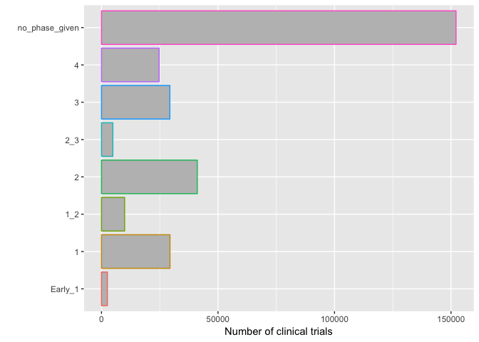
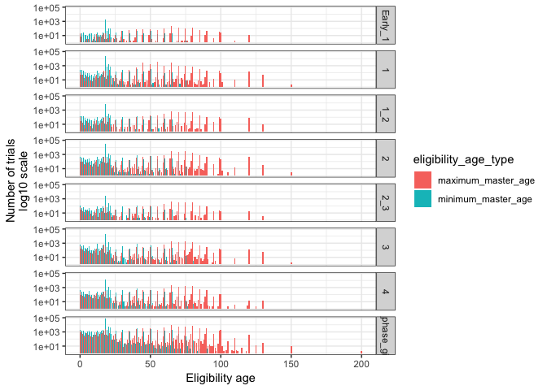
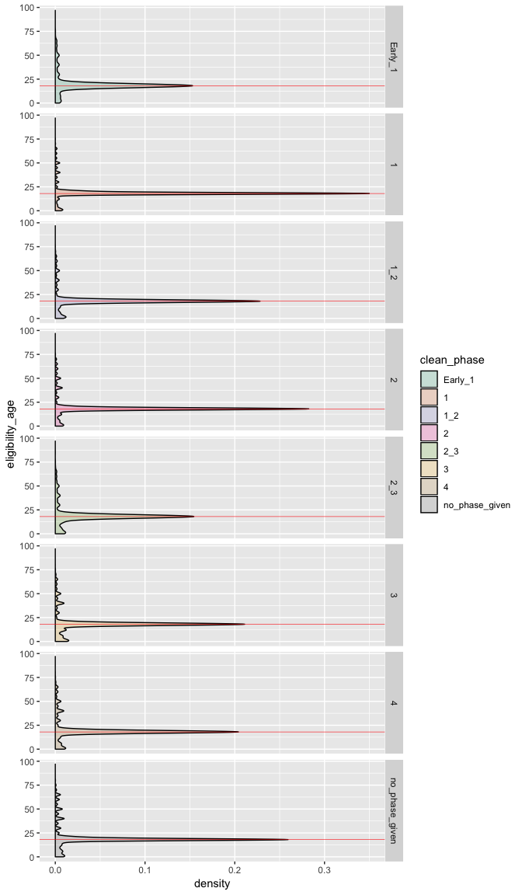

Clinical trials, phases, and their types
================

## Introduction

This notebook outlines the exploration of the processed data from this
[notebook](id-ing_Qs_hypotheses_about_CTs.md)

``` r
library(tidyverse)
```

    ## ── Attaching packages ───────────────────────── tidyverse 1.2.1 ──

    ## ✔ ggplot2 3.0.0     ✔ purrr   0.2.5
    ## ✔ tibble  1.4.2     ✔ dplyr   0.7.6
    ## ✔ tidyr   0.8.1     ✔ stringr 1.3.1
    ## ✔ readr   1.1.1     ✔ forcats 0.3.0

    ## ── Conflicts ──────────────────────────── tidyverse_conflicts() ──
    ## ✖ dplyr::filter() masks stats::filter()
    ## ✖ dplyr::lag()    masks stats::lag()

## Load data

``` r
data <- read_csv("study_phase_age_eligibility.csv")
```

    ## Parsed with column specification:
    ## cols(
    ##   nct_id = col_character(),
    ##   clean_phase = col_character(),
    ##   minimum_master_age = col_integer(),
    ##   maximum_master_age = col_integer()
    ## )

## Frequency of trials in different phases

I previously looked at this but I want to put the data here too

``` r
data %>% 
  ggplot() +
  geom_bar(aes(forcats::fct_infreq(clean_phase),color=clean_phase),fill="gray") +
  coord_flip() +
  ylab("Number of clinical trials") +
  xlab("") +
  theme(
    legend.position = "none"
  )
```

<!-- -->

## Are trials given for many phases or just one?

``` r
tmp <- data %>% 
  distinct(nct_id,clean_phase) %>% 
  count(nct_id) %>% 
  arrange(desc(n))

tmp
```

    ## # A tibble: 291,790 x 2
    ##    nct_id          n
    ##    <chr>       <int>
    ##  1 NCT00000102     1
    ##  2 NCT00000104     1
    ##  3 NCT00000105     1
    ##  4 NCT00000106     1
    ##  5 NCT00000107     1
    ##  6 NCT00000108     1
    ##  7 NCT00000110     1
    ##  8 NCT00000111     1
    ##  9 NCT00000112     1
    ## 10 NCT00000113     1
    ## # ... with 291,780 more rows

Nope. Trials are only in one phase or phase combo or not given.

## What is the eligibility age distribution for trials?

``` r
data %>% 
  filter(is.na(clean_phase))
```

    ## # A tibble: 150,591 x 4
    ##    nct_id      clean_phase minimum_master_age maximum_master_age
    ##    <chr>       <chr>                    <int>              <int>
    ##  1 NCT00000104 <NA>                        NA                 NA
    ##  2 NCT00000105 <NA>                        18                 NA
    ##  3 NCT00000106 <NA>                        18                 65
    ##  4 NCT00000107 <NA>                        17                 60
    ##  5 NCT00000108 <NA>                        50                 65
    ##  6 NCT00000110 <NA>                        18                 49
    ##  7 NCT00000112 <NA>                         8                 18
    ##  8 NCT00000126 <NA>                        50                 NA
    ##  9 NCT00000133 <NA>                        NA                  1
    ## 10 NCT00000147 <NA>                        18                 46
    ## # ... with 150,581 more rows

``` r
data_eligibility_age_gathered <- data %>% 
  gather(eligibility_age_type,eligibility_age,-nct_id,-clean_phase) 

data_eligibility_age_gathered%>% 
  ggplot() +
  geom_vline(xintercept=18,color="darkgray",size=.5) +
  geom_histogram(aes(eligibility_age,fill=eligibility_age_type),bins=200) +
  scale_x_log10() +
  scale_y_log10() +
  facet_grid(clean_phase~.) +
  ylab("Number of trials") +
  xlab("Eligibility age")
```

    ## Warning: Transformation introduced infinite values in continuous x-axis

    ## Warning: Removed 171472 rows containing non-finite values (stat_bin).

    ## Warning: Transformation introduced infinite values in continuous y-axis

    ## Warning: Removed 1844 rows containing missing values (geom_bar).

<!-- -->

This may not be the easiest graph to look at, but it gives some good
insight.

1)  The eligibility is roughly the same for trials without a phase and
    with a phase.

2)  The spike (dark gray line) for the minimum age is expected - it’s
    the legal age for consent to trials will allow them to enroll more
    easily.

I think there’ subtle changes in bar height across the phases, so I
think I’ll want to look more closely at this.

## Is the minumum age significantly lower across phases?

I’m not interested in the maximum age, just whether younger patients are
eligible for trials for which they have historically not been.

``` r
df <- data_eligibility_age_gathered %>% 
  filter(eligibility_age_type=="minimum_master_age") %>% 
  select(-eligibility_age_type,nct_id) 

df[is.na(df$clean_phase),"clean_phase"] <- "no_phase_given"

df %>% 
  ggplot() +
  geom_density(aes(
    eligibility_age,
    group=factor(clean_phase),
    fill=clean_phase),
    na.rm = F,alpha=.2) +
  geom_vline(xintercept=18,
             color="red",
             size=.2) +
  scale_fill_brewer(palette="Dark2") +
  facet_grid(clean_phase~.) +
  coord_flip()
```

    ## Warning: Removed 24733 rows containing non-finite values (stat_density).

<!-- -->

``` r
g <- glm(eligibility_age ~ clean_phase - 1,
      data=df,
      family="quasipoisson")

g$coefficients[order(g$coefficients)]
```

    ##            clean_phase1_2              clean_phase1 
    ##                  2.933713                  2.949882 
    ##              clean_phase3            clean_phase2_3 
    ##                  2.953034                  2.963466 
    ##              clean_phase2              clean_phase4 
    ##                  2.970851                  3.006411 
    ## clean_phaseno_phase_given 
    ##                  3.014437

``` r
a <- aov(g)

summary(a)
```

    ##                 Df    Sum Sq  Mean Sq F value Pr(>F)    
    ## clean_phase      7 105766884 15109555  128291 <2e-16 ***
    ## Residuals   267050  31452026      118                   
    ## ---
    ## Signif. codes:  0 '***' 0.001 '**' 0.01 '*' 0.05 '.' 0.1 ' ' 1
    ## 24733 observations deleted due to missingness

``` r
TukeyHSD(a)
```

    ##   Tukey multiple comparisons of means
    ##     95% family-wise confidence level
    ## 
    ## Fit: aov(formula = g)
    ## 
    ## $clean_phase
    ##                           diff         lwr         upr     p adj
    ## 1_2-1              -0.30639312 -0.68459820  0.07181196 0.2032777
    ## 2-1                 0.40481434  0.16024633  0.64938235 0.0000219
    ## 2_3-1               0.26128322 -0.24755543  0.77012187 0.7365826
    ## 3-1                 0.06030727 -0.20511110  0.32572563 0.9941954
    ## 4-1                 1.11102995  0.83334237  1.38871753 0.0000000
    ## no_phase_given-1    1.27392994  1.07112145  1.47673843 0.0000000
    ## 2-1_2               0.71120746  0.34239577  1.08001916 0.0000003
    ## 2_3-1_2             0.56767634 -0.01122377  1.14657644 0.0588211
    ## 3-1_2               0.36670039 -0.01625583  0.74965660 0.0709664
    ## 4-1_2               1.41742307  1.02586344  1.80898271 0.0000000
    ## no_phase_given-1_2  1.58032306  1.23777403  1.92287209 0.0000000
    ## 2_3-2              -0.14353113 -0.64542729  0.35836503 0.9803758
    ## 3-2                -0.34450708 -0.59635999 -0.09265416 0.0010804
    ## 4-2                 0.70621561  0.44146407  0.97096715 0.0000000
    ## no_phase_given-2    0.86911559  0.68441512  1.05381607 0.0000000
    ## 3-2_3              -0.20097595 -0.71335584  0.31140394 0.9102213
    ## 4-2_3               0.84974674  0.33090511  1.36858837 0.0000283
    ## no_phase_given-2_3  1.01264672  0.52972072  1.49557273 0.0000000
    ## 4-3                 1.05072269  0.76659811  1.33484726 0.0000000
    ## no_phase_given-3    1.21362267  1.00208623  1.42515911 0.0000000
    ## no_phase_given-4    0.16289998 -0.06384028  0.38964025 0.3417150

``` r
plot(TukeyHSD(a))
```

<!-- -->

Seems like yes by the difference in peak heights on the graph. I logged
the ages so the differences could come out more and I flipped the graph
for easier comparison of peak heights. The red line indicates 18 years
of age and is just a indicator for me-it lines up perfectly with the
peak density.

The glm tells me about how the age distributions differ across the
phases. I use family=“quasipoisson” because the response is made of
integers and I think the dispersion is different across the phases. I
took out the intercept so I could see coefficients for all the phases
(leaving in the intercept doesn’t make much sense).

I also show the coefficient values for easier interpretation.

I also perform an anova on the model and do a tukey test to see which
distributions are different from particular phases.

The first density plot shows pretty much only that the density at 18
years of age is different, meaning the minimum eligible age distribution
does change but not exactly how. The GLM quantifies the association of
the phases to the minimum eligibility age giving the first indication
that lower phases are associated to lower minimum ages. But is that
significant and between which phases? The anova on the model says,
overall, yes. The tukey test says that particular phase distributions
are significantly different (the right phase has a higher minimum age
than the left):

phases 1 and 2,

phases 1 and 4,

phases 1 and NA

phases 1\_2 and 2,

phases 1\_2 and 4 (2nd most different),

phases 1\_2 and NA (most different),

phases 3 and 2,

phases 2 and 4,

phases NA and 2

phases 2\_3 and 4,

phases 2\_3 and NA and

phases 3 and 4

These phases are not significantly different:

phases 1\_2 and 1

phases 1 and 2\_3

phases 1 and 3

phases 1\_2 and 3

phases 2 and 2\_3, and

phases 3 and 2\_3

## Interpretation and what to do moving forward

This mostly makes sense to me, but I’m sure there’s other factors at
play that give more intuition to these statistics.

This gives me some indication that more clinical trials that include
pediatric patients are in earlier phases and aren’t later phases. Later
phase clinical trials are supposed to enroll more patients and thus a
larger patient age span so that makes sense. Earlier phases clinical
trials are more checking for rare adverse reactions or determining
efficacy of a drug and its dosage, so I would hope that kids are
enrolled in those trials.

I think at this point I may want to either better define or scope my
question to bin pediatric patients or move on to other investigations.
Stay tuned.
